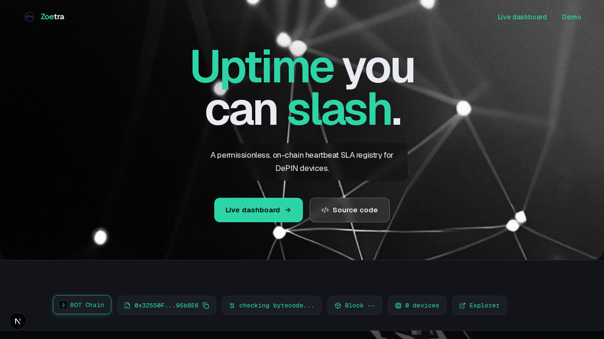
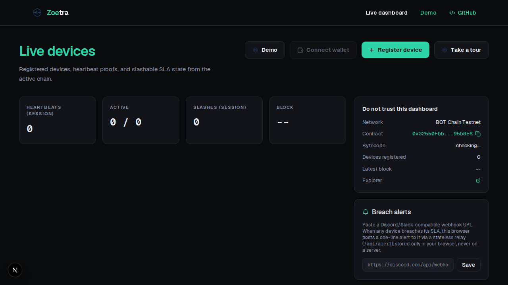
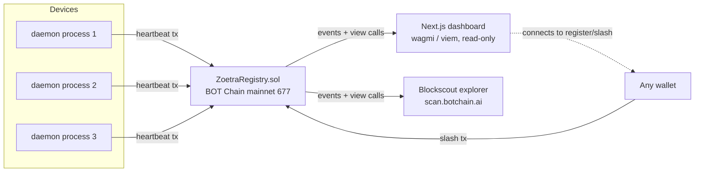
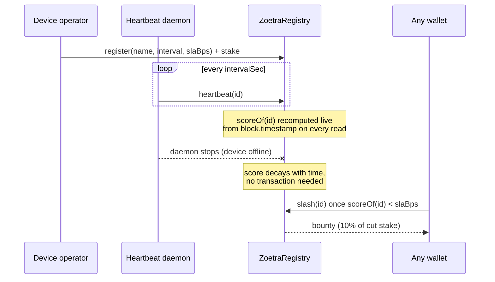

# Zoetra

**Uptime you can slash.**

A permissionless, on-chain heartbeat SLA registry for DePIN devices, deployed on BOT Chain. Most DePIN uptime systems are closed  -  Helium's proof-of-coverage only works for Helium hotspots, io.net's monitoring only works for io.net nodes. Zoetra is open to any device, from any network. There's no backend: uptime is scored live, entirely on-chain, from `block.timestamp` alone, no cron job, no indexer, no server keeping score. Operators stake native BOT against their own declared SLA, and if they breach it, **anyone**  -  not an admin, not Zoetra  -  can slash the stake and earn a bounty for catching it.

None of this works without BOT Chain. Sub-second finality and near-zero fees are what turn a heartbeat every few seconds into a real, affordable transaction instead of a toy.

[](https://github.com/mystiquemide/zoetra/actions/workflows/ci.yml)
[](https://github.com/mystiquemide/zoetra/actions/workflows/codeql.yml)
[](./LICENSE)
[](https://nextjs.org)
[](./contracts)
[](https://dev-docs.botchain.ai/docs/Developers/quick-guide/)

- **Live dashboard:** https://zoetra.xyz/live
- **Contract (BOT Chain mainnet, chain 677):** [`0x42233C40D7bE6ce4cECE6736D8bC0381d9Ea17Ac`](https://scan.botchain.ai/address/0x42233C40D7bE6ce4cECE6736D8bC0381d9Ea17Ac)

## Product screens





## What to watch for

1. Three device wallets heartbeat every 60 seconds, each one a real transaction.
2. Every card's score is computed live on-chain from `block.timestamp`, not cached or polled from a database.
3. Stop a device's daemon (`Ctrl+C` on `daemon/heartbeat.mjs`) and its score decays visibly within seconds.
4. Once a device's score falls below its own SLA, the Slash button activates for anyone with a connected wallet, and pays a bounty for catching the breach.
5. The "Live event feed" on `/live` only shows events emitted after your browser tab opened (see `src/hooks/use-live-feed.ts`); it does not backfill history. A fresh page load will say "Waiting for the first heartbeat..." until the next one lands, which happens within each device's declared interval (60s for the live demo devices). This is expected, not a bug, the device cards above it already show real, accumulated on-chain `recv`/`exp` counts and score.

## How it works

1. **Register and stake**  -  declare a heartbeat interval (5–300s) and an SLA threshold (50–99.99%), stake ≥0.05 BOT.
2. **Heartbeat on-chain**  -  every beat is a real transaction. `scoreOf(id)` computes uptime live from a two-bucket rolling window and `block.timestamp`, so the score decays in real time even between transactions, no cron job required.
3. **Breach gets slashed**  -  once `scoreOf(id) < slaBps`, anyone can call `slash(id)`. 20% of the remaining stake is slashed, 10% of that goes to the caller as a bounty, the rest is burned.

## Architecture

No database, no backend API. The chain is the only source of truth; the dashboard is a pure read over contract events and view functions, so every number it shows is independently reproducible from the block explorer alone.





See [`docs/ARCHITECTURE.md`](docs/ARCHITECTURE.md) for the full design and trust boundaries, [`docs/PRD.md`](docs/PRD.md) for product scope, and [`docs/DESIGN.md`](docs/DESIGN.md) for the UI spec.

## Features

- Permissionless registration  -  any wallet, any device, no allowlist
- Live on-chain uptime scoring from `block.timestamp`, no indexer or cron
- Permissionless slashing with a caller bounty
- In-app block explorer (`/tx/[hash]`, `/address/[addr]`) so every claim is verifiable without leaving the app
- Wallet support for both injected extensions and WalletConnect (mobile-only wallets, including BOT Chain's own BO Wallet)
- Optional breach-alert webhook relay, stateless, no server-side storage

## Tech stack

- **Contracts:** Solidity 0.8.28, Hardhat, 23 passing tests
- **Frontend:** Next.js 16 (App Router), TypeScript, Tailwind v4
- **Web3:** wagmi v2, viem, RainbowKit
- **Daemon:** Node.js + viem wallet client, one process per device
- **Explorer data:** BOTScan / Blockscout REST API (`scan.botchain.ai`)

## Repository layout

```
contracts/   Hardhat workspace: ZoetraRegistry.sol, tests, deploy/setup scripts
daemon/      heartbeat.mjs  -  one process per device, viem wallet client
src/         Next.js App Router dashboard (wagmi + RainbowKit + viem)
docs/        Architecture, product spec, design system, analytics, task breakdown
```

## Quick start

### Contracts

```bash
cd contracts
npm install
npx hardhat test                              # 23 tests, all passing
cp .env.example .env                          # RPC URLs (non-secret)
# put DEPLOYER_PRIVATE_KEY in a separate .env you control, e.g. ../.secrets/deployer.env
npx hardhat run scripts/deploy.js --network botchain
```

BOT Chain mainnet (`botchain`, chain 677) is the production target. The legacy Bohr testnet config remains available only for local experiments.

### Daemon (per device)

```bash
cd daemon
npm install
cp .env.example .env
# fill RPC_URL, REGISTRY_ADDRESS, PRIVATE_KEY, DEVICE_ID, INTERVAL_MS
npm start
```

Run one process per device. Each is a real funded wallet sending real transactions  -  killing the process is the actual "device went offline" event, there's no simulated-failure switch anywhere in this codebase.

### Dashboard

```bash
npm install
cp .env.example .env
npm run dev
```

`NEXT_PUBLIC_CHAIN=mainnet` points the app at BOT Chain mainnet. If unset, the app now defaults to mainnet.

> **Note:** Next.js blocks client-side dev resource requests when the dev server is accessed via `127.0.0.1` without `allowedDevOrigins` configured (see `next.config.ts`), which silently breaks all on-chain reads. Use `localhost`, or add your origin there if you hit an empty dashboard locally.

See [`docs/DEPLOYMENT.md`](docs/DEPLOYMENT.md) for production deployment.

## Environment variables

| Variable | Where | Required | Description |
|---|---|---|---|
| `NEXT_PUBLIC_CHAIN` | dashboard | no | `mainnet` (default). `testnet` is only for legacy local experiments. |
| `NEXT_PUBLIC_REGISTRY_ADDRESS` | dashboard | no | Overrides the built-in registry address |
| `NEXT_PUBLIC_WALLET_CONNECT_PROJECT_ID` | dashboard | no | Reown/WalletConnect Cloud project id |
| `RPC_URL` | daemon | yes | JSON-RPC endpoint for the target chain |
| `REGISTRY_ADDRESS` | daemon | yes | Deployed `ZoetraRegistry` address |
| `PRIVATE_KEY` | daemon | yes | Device operator wallet key (never commit this) |
| `DEVICE_ID` | daemon | yes | On-chain device id to heartbeat for |
| `INTERVAL_MS` | daemon | yes | Heartbeat interval in milliseconds |

## Scripts

| Command | Runs where | Does |
|---|---|---|
| `npm run dev` | root | Start the dashboard on `localhost:3010` |
| `npm run build` | root | Production build |
| `npm run lint` | root | ESLint |
| `npx hardhat test` | `contracts/` | Run the 23-test suite |
| `npx hardhat run scripts/deploy.js` | `contracts/` | Deploy the registry |
| `npm start` | `daemon/` | Run one heartbeat process |

## What's verifiable

Contract deployment, registered devices, heartbeats, and slashes shown on the live dashboard are real transactions on BOT Chain mainnet, independently checkable at [scan.botchain.ai](https://scan.botchain.ai/address/0x42233C40D7bE6ce4cECE6736D8bC0381d9Ea17Ac). The dashboard's own `/tx/[hash]` and `/address/[addr]` pages decode and display the same data without leaving the app.

Wallet support covers injected extensions (MetaMask, Coinbase Wallet, Rabby, Brave, etc.) and WalletConnect for mobile-only wallets, including **BO Wallet**, the wallet BOT Chain's own developer docs list alongside MetaMask. BO Wallet has no browser extension, so WalletConnect QR pairing is the only way to connect it, using a real registered project on Reown Cloud.

## Roadmap

**Now (cheap, no new architecture):**
- Verify the deployed contract source on Blockscout
- Publish the heartbeat client as an installable package instead of a copy-pasted script
- Expand the mainnet device fleet beyond the first verified demo device

**Near-term:**
- Device profile pages with historical uptime charts
- An operator trust score aggregating a single operator's record across all their devices
- Lightweight clients for hardware that can't run a full Node process (ESP32/Arduino-class devices), likely via a companion relay or session keys so cheap hardware doesn't need to hold funds directly

**Medium-term (the business model in the registry itself):**
- Delegated staking: let third parties back a device's stake without being its operator, liquid staking for uptime bonds
- SLA insurance: let underwriters pool capital that pays out if a device gets slashed, in exchange for a premium
- A public cross-device leaderboard/explorer, once there's a real fleet to rank

**The honest hard problem:** a heartbeat today only proves a *wallet* is active, not that the *physical device* sent it  -  anyone holding the key could run the daemon from anywhere. The real fix is hardware-rooted attestation (a signature from a TPM or secure element on the device itself), which is a hardware engineering project, not a smart contract change.

**The bigger one:** oracle bridges into existing closed DePIN networks (Helium, io.net) that pull their existing attestations into this registry too, so adoption doesn't require every device to abandon its current network.

## Contributing

Contributions are welcome. See [`CONTRIBUTING.md`](CONTRIBUTING.md) for local setup and PR conventions.

## Security

See [`SECURITY.md`](SECURITY.md) for how to report a vulnerability.

## License

[MIT](LICENSE)
