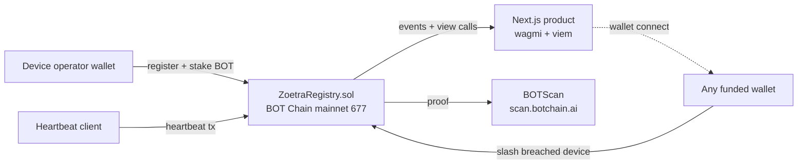

# Zoetra

**Uptime you can slash.**

Zoetra is a permissionless heartbeat SLA registry for DePIN operators on **BOT Chain mainnet**. A device registers on-chain, stakes native BOT, and promises to send heartbeat transactions at a declared interval. If its uptime score falls below its own SLA, anyone can slash part of the stake and earn a bounty.

This is not a monitoring dashboard with private uptime claims. The chain is the product: every registration, heartbeat, score, slash, bounty, and burn is reproducible from BOTScan.

[](https://github.com/mystiquemide/zoetra/actions/workflows/ci.yml)
[](https://github.com/mystiquemide/zoetra/actions/workflows/codeql.yml)
[](./LICENSE)
[](https://nextjs.org)
[](./contracts)
[](https://dev-docs.botchain.ai/docs/Developers/quick-guide/)

## Live proof

| Surface | Link |
|---|---|
| Product | https://zoetra.xyz/live |
| Verification walkthrough | https://zoetra.xyz/proof |
| Source | https://github.com/mystiquemide/zoetra |
| Mainnet contract | [`0x42233C40D7bE6ce4cECE6736D8bC0381d9Ea17Ac`](https://scan.botchain.ai/address/0x42233C40D7bE6ce4cECE6736D8bC0381d9Ea17Ac) |
| Verified source | https://scan.botchain.ai/address/0x42233C40D7bE6ce4cECE6736D8bC0381d9Ea17Ac#code |
| Deploy tx | https://scan.botchain.ai/tx/0xe2c09b1247462eb055a60250bf6915f5087c0432d96dedabb95f8fa9650b7258 |
| Production device registration | https://scan.botchain.ai/tx/0x055bd7b9aba0272cd0530fda82bb102d5d8783347c575419cca298a8eacb679a |
| Latest heartbeat proof | https://scan.botchain.ai/tx/0x87fdd75a61ddfce701a0028030023b9a577c20c5f67eafa9addf2028163fec21 |
| Retired review device | https://scan.botchain.ai/tx/0xf2907f48405a4b39d3b4108745b39c592951d56fd51c004b3e4c27f06e409456 |

## Try it in 2 minutes

1. Open https://zoetra.xyz/live.
2. Confirm the verification panel shows BOT Chain, detected bytecode, the mainnet contract, and the latest block.
3. Open the contract on BOTScan from the panel.
4. Connect a wallet on BOT Chain mainnet if you want to register or slash.
5. If you need BOT, bridge funds at https://bridge.botchain.ai and swap at https://dex.botchain.ai.
6. Register a device with a name, interval, SLA, and at least `0.05 BOT` stake.
7. Run the heartbeat client with that device id. If the heartbeat stops, the score decays on-chain and eventually becomes slashable.

## How it works

| Operation | What happens on BOT Chain mainnet |
|---|---|
| `register(name, intervalSec, slaBps)` | The operator stakes native BOT and creates a device promise. |
| `heartbeat(id)` | The operator wallet proves the device is still alive. |
| `scoreOf(id)` | The contract computes the uptime score live from `block.timestamp` and recorded beats. |
| `slash(id)` | Anyone can cut a breached device's stake once score falls below its SLA. |
| `deregister(id)` | The operator stops the obligation and starts the withdrawal cooldown. |
| `withdraw(id)` | The operator withdraws remaining stake after cooldown. |

Core scoring rule:

```text
score = min(10000, receivedHeartbeats * 10000 / expectedHeartbeats)
```

The contract does not need an admin, database, keeper, oracle, or private monitor. Time passing on-chain is enough to make a silent device decay.

## BOT Chain integrations

| Integration | Where it is used | Why it matters |
|---|---|---|
| BOT Chain mainnet `677` | Contract, dashboard, wallet writes, heartbeat client | Real production settlement for uptime promises and slashing. |
| Native BOT | Device stake, gas, caller bounty, burn path | No ERC-20 approval layer. The same asset pays gas and secures the SLA. |
| BOT Chain RPC `https://rpc.botchain.ai` | Frontend reads, daemon writes, verification scripts | Live chain state is the source of truth. |
| BOTScan `https://scan.botchain.ai` | Contract proof, tx proof, explorer links, README links | Judges can independently verify every claim. |
| BOT Chain bridge | User funding path | New operators can bring funds onto BOT Chain mainnet. |
| BOT Chain DEX | BOT acquisition path | Users can swap bridged assets into BOT for gas and stake. |
| BO Wallet via WalletConnect | Mobile wallet path | BOT Chain's mobile wallet can connect even without a browser extension. |
| wagmi + viem + RainbowKit | Read/write frontend | Wallet connection, chain switching, contract reads, and transactions. |
| Hardhat + verified source | Contract deployment and verification | Reproducible build, tests, deployment, and BOTScan source verification. |
| Vercel | Public product hosting | Fast judge-accessible product URL with production environment variables. |
| GitHub Actions CI + CodeQL | Repo quality gates | Tests and security scanning run on pushed commits. |
| Stateless webhook relay | Optional breach notifications | Browser-held webhook URL can receive alerts without adding a database. |

## Hackathon winner plan

This repo is structured around the judge surfaces that matter for BOT Chain Builder Challenge review.

| Judge surface | Zoetra proof |
|---|---|
| Load-bearing chain use | The heartbeat protocol needs low-fee, fast-finality transactions. BOT Chain is not a logo placement. |
| Mainnet deployment | Contract is live and verified on BOT Chain mainnet. |
| Public product | `zoetra.xyz/live` reads the mainnet contract directly. |
| Verifiable proof | Contract, device registration, heartbeat, bytecode, and device state are all on BOTScan. |
| Completeness | Contract, app, wallet connection, heartbeat client, docs, CI, CodeQL, and production deployment are shipped. |
| Innovation | Uptime is scored by an on-chain SLA market, not by a closed monitoring vendor. |
| Judge speed | The live product and proof links let a reviewer verify the project in minutes. |
| Honest limitations | Physical-device attestation is not solved yet; today the protocol proves a registered operator key sent heartbeats. |

## Hackathon judge review playbook

A skeptical judge should test Zoetra this way:

| Check | What to verify | Expected result |
|---|---|---|
| Product loads | Open `zoetra.xyz/live` | The dashboard renders live mainnet state. |
| No private database claims | Compare the dashboard contract with BOTScan | Same mainnet contract address. |
| Bytecode exists | Check verification panel or BOTScan | Bytecode detected and source verified. |
| Device is real | Inspect device `#2` and its registration tx | Registered as `zoetra-mainnet-sentinel` with `0.05 BOT` stake. |
| Heartbeat is real | Open latest heartbeat tx | Transaction calls `heartbeat` on the registry. |
| Scoring is contract-owned | Let a device miss intervals or inspect `scoreOf` | Score changes from on-chain time and beat history. |
| Slashing is permissionless | Connect any funded wallet when a device breaches | Slash button becomes executable below SLA. |
| No admin backdoor | Inspect verified contract | No owner-only override or admin scoring function. |

## Product screens


## Architecture



No database, no account system, no admin key. The only source of truth is `ZoetraRegistry` on BOT Chain mainnet.

## Repository layout

```text
contracts/   Hardhat workspace: ZoetraRegistry.sol, tests, deployment and device scripts
daemon/      heartbeat.mjs - one process per device, viem wallet client
src/         Next.js App Router product (wagmi + RainbowKit + viem)
docs/        Architecture, deployment, product notes, and verification plans
```

## Run locally

```bash
git clone https://github.com/mystiquemide/zoetra.git
cd zoetra
npm install
npm run build
npm run dev
```

Contract tests:

```bash
cd contracts
npm install
npm test
```

Heartbeat client:

```bash
cd daemon
npm install
cp .env.example .env
# fill PRIVATE_KEY and DEVICE_ID for your registered device
npm start
```

## Environment variables

| Variable | Where | Required | Description |
|---|---|---|---|
| `NEXT_PUBLIC_REGISTRY_ADDRESS` | frontend | no | Overrides the built-in mainnet registry address. |
| `NEXT_PUBLIC_WALLET_CONNECT_PROJECT_ID` | frontend | no | Reown/WalletConnect project id for mobile wallets. |
| `RPC_URL` | daemon | yes | BOT Chain mainnet JSON-RPC endpoint. |
| `CHAIN_ID` | daemon | yes | `677`. |
| `REGISTRY_ADDRESS` | daemon | yes | Mainnet registry address. |
| `PRIVATE_KEY` | daemon | yes | Device operator wallet key. Never commit this. |
| `DEVICE_ID` | daemon | yes | On-chain device id to heartbeat for. |
| `INTERVAL_MS` | daemon | yes | Heartbeat interval in milliseconds. Contract supports 5-300 seconds. |
| `MAX_BEATS` | daemon | no | Optional cap for controlled proof runs. `0` means continuous. |

## Security and limitations

- The contract is tested and source-verified, but it is not formally audited.
- A heartbeat proves the registered operator key sent a transaction. It does not yet prove a physical device signed from hardware-rooted attestation.
- If a device, wallet, RPC, or operator infrastructure misses heartbeats, the score decays exactly as the contract defines.
- Slashing is irreversible once a valid transaction executes.
- There is no admin recovery key and no centralized dispute process.

## What is real

Everything in the shipped product path is real: the contract is on BOT Chain mainnet, the source is verified, the dashboard reads live chain state, and the heartbeat/client path sends real transactions. There are no mocked dashboard values in the production `/live` path.

## License

[MIT](LICENSE)
