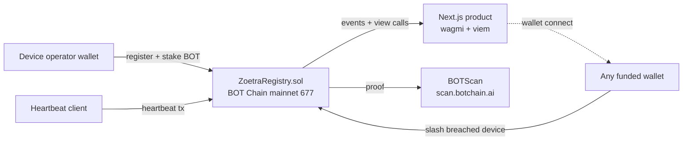

# Zoetra

**Uptime you can slash.**

Zoetra is a permissionless heartbeat SLA registry for DePIN operators on **BOT Chain mainnet**. A device registers on-chain, stakes native BOT, and promises to send heartbeat transactions at a declared interval. If its uptime score falls below its own SLA, anyone can slash part of the stake and earn a bounty.

This is not a private monitoring dashboard. The chain is the product: every registration, heartbeat, score, slash, bounty, and burn is reproducible from BOTScan.

[](https://github.com/mystiquemide/zoetra/actions/workflows/ci.yml)
[](https://github.com/mystiquemide/zoetra/actions/workflows/codeql.yml)
[](./LICENSE)
[](https://nextjs.org)
[](./contracts)
[](https://dev-docs.botchain.ai/docs/Developers/quick-guide/)

## Live product

| Surface | Link |
|---|---|
| Product | https://zoetra.xyz/live |
| Verification walkthrough | https://zoetra.xyz/proof |
| Source | https://github.com/mystiquemide/zoetra |
| Mainnet contract | [`0x42233C40D7bE6ce4cECE6736D8bC0381d9Ea17Ac`](https://scan.botchain.ai/address/0x42233C40D7bE6ce4cECE6736D8bC0381d9Ea17Ac) |
| Verified source | https://scan.botchain.ai/address/0x42233C40D7bE6ce4cECE6736D8bC0381d9Ea17Ac#code |
| Deploy tx | https://scan.botchain.ai/tx/0xe2c09b1247462eb055a60250bf6915f5087c0432d96dedabb95f8fa9650b7258 |
| Production device registration | https://scan.botchain.ai/tx/0x055bd7b9aba0272cd0530fda82bb102d5d8783347c575419cca298a8eacb679a |
| Heartbeat proof | https://scan.botchain.ai/tx/0x2e3d6fa119bb4dc39ebd967e96530469ce6025219e876a3fda32f4b66375e61b |

## How it works

| Operation | What happens on BOT Chain mainnet |
|---|---|
| `register(name, intervalSec, slaBps)` | The operator stakes native BOT and creates a device uptime promise. |
| `heartbeat(id)` | The operator wallet proves the device is still alive. |
| `scoreOf(id)` | The contract computes uptime live from `block.timestamp` and recorded beats. |
| `slash(id)` | Anyone can cut a breached device's stake once score falls below its SLA. |
| `deregister(id)` | The operator stops the obligation and starts the withdrawal cooldown. |
| `withdraw(id)` | The operator withdraws remaining stake after cooldown. |

Core scoring rule:

```text
score = min(10000, receivedHeartbeats * 10000 / expectedHeartbeats)
```

The contract does not need an admin, database, keeper, oracle, or private monitor. Time passing on-chain is enough to make a silent device decay.

## BOT Chain integrations

| Integration | Where it is used |
|---|---|
| BOT Chain mainnet `677` | Contract state, dashboard reads, wallet writes, heartbeat transactions, and slashing. |
| Native BOT | Device stake, gas, caller bounty, and burn path. |
| BOT Chain RPC `https://rpc.botchain.ai` | Frontend reads, daemon writes, and verification scripts. |
| BOTScan `https://scan.botchain.ai` | Contract source, transaction history, and explorer links. |
| BOT Chain bridge | User funding path into BOT Chain. |
| BOT Chain DEX | Swap path into BOT for gas and stake. |
| BO Wallet via WalletConnect | Mobile wallet connection through QR pairing. |
| wagmi + viem + RainbowKit | Wallet connection, chain reads, and contract transactions. |
| Hardhat | Contract testing, deployment, and verification. |
| Vercel | Public production hosting. |
| GitHub Actions + CodeQL | CI and static security checks. |
| Stateless webhook relay | Optional breach notifications without storing webhook URLs server-side. |

## Verification path

1. Open https://zoetra.xyz/live.
2. Confirm the verification panel shows BOT Chain, detected bytecode, the mainnet contract, and the latest block.
3. Open the contract on BOTScan from the panel.
4. Inspect the production device and heartbeat transactions.
5. Connect a funded wallet on BOT Chain mainnet if you want to register a device or slash a breached one.
6. If you need BOT, bridge funds at https://bridge.botchain.ai and swap at https://dex.botchain.ai.

## Product screens


## Architecture



No database, no account system, no admin key. The only source of truth is `ZoetraRegistry` on BOT Chain mainnet.

## Repository layout

```text
contracts/   Hardhat workspace: ZoetraRegistry.sol, tests, deployment scripts
daemon/      heartbeat.mjs - one process per device, viem wallet client
src/         Next.js App Router product (wagmi + RainbowKit + viem)
docs/        Product architecture and deployment notes
```

## Run locally

```bash
git clone https://github.com/mystiquemide/zoetra.git
cd zoetra
npm install
npm run build
npm run dev
```

Contract tests:

```bash
cd contracts
npm install
npm test
```

Heartbeat client:

```bash
cd daemon
npm install
cp .env.example .env
# fill PRIVATE_KEY and DEVICE_ID for your registered device
npm start
```

## Environment variables

| Variable | Where | Required | Description |
|---|---|---|---|
| `NEXT_PUBLIC_REGISTRY_ADDRESS` | frontend | no | Overrides the built-in mainnet registry address. |
| `NEXT_PUBLIC_WALLET_CONNECT_PROJECT_ID` | frontend | no | Reown/WalletConnect project id for mobile wallets. |
| `RPC_URL` | daemon | yes | BOT Chain mainnet JSON-RPC endpoint. |
| `CHAIN_ID` | daemon | yes | `677`. |
| `REGISTRY_ADDRESS` | daemon | yes | Mainnet registry address. |
| `PRIVATE_KEY` | daemon | yes | Device operator wallet key. Never commit this. |
| `DEVICE_ID` | daemon | yes | On-chain device id to heartbeat for. |
| `INTERVAL_MS` | daemon | yes | Heartbeat interval in milliseconds. Contract supports 5-300 seconds. |
| `MAX_BEATS` | daemon | no | Optional cap for controlled proof runs. `0` means continuous. |

## Security and limitations

- The contract is tested and source-verified, but it is not formally audited.
- A heartbeat proves the registered operator key sent a transaction. It does not yet prove a physical device signed from hardware-rooted attestation.
- If a device, wallet, RPC, or operator infrastructure misses heartbeats, the score decays exactly as the contract defines.
- Slashing is irreversible once a valid transaction executes.
- There is no admin recovery key and no centralized dispute process.

## What is real

Everything in the shipped product path is real: the contract is on BOT Chain mainnet, the source is verified, the dashboard reads live chain state, and the heartbeat client sends real transactions. There are no mocked dashboard values in the production `/live` path.

## License

[MIT](LICENSE)
